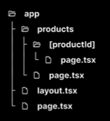
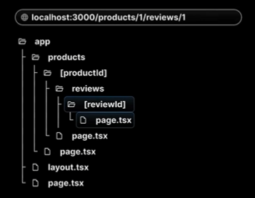

# **React Server Components**
React Server Components is a new architecture that was introduced by the React team and quickly adopted by Next.js. 
This architecture introduces a new approach to creating **React** componnets by dividing them into two distinct types:
- **Server components**
- **Client components**

### **Server Components**
- By default, Next.js treats all components as **Server** components
- These components can perform server-side tasks like reading files or fetching data directly from a database
- The trade-off is that they can't use *React hooks* or *handle user interactions*

### **Client Components**
- To create a Client component, you will need to add the **"use client** directive at the top of your component file
- While Client component cannot perform *server-side tasks* like readinf files, they can use *hooks* and *handle user interctions*
- Client components are the traditional React components you're already familiar with from orevious versions of React

### **React Server Components & Routing**
We will work with **server components** that wait for certain operations to complete before rendering content. 
We will also use **client components** to take advantage of hooks from the routing module.

# **Routing**
Next.js has a file-system based routing system. 
URLs you can access in your browser are determined by how you organize your files and folders in your code.

### **Routing conventions**
1. All routes must live inside the app folder
2. Route files must be named either ***page.js*** or ***page.tsx***
3. Each folder represents a segment of the URL path

When these conventions are followed, the file automatically becomes available as a route.

### **Page Structure**

- all the routes are inside the ***app folder***
- the ***page.tsx*** under the ***app folder*** is the main page (**Home page**)
- to create a different page, appropriate folders are made inside the app folder (for ex, about, profile)
- all the routes are named using ***page.tsx*** file under the appropriate folder
- in Next.js, no need to create perfect routing structure like in React, the **file/folder structure** will handle the ***routing***
- if the user searches for any other routes that do not exist, Next.js will automatically show him a built-in ***"Error 404: Page Not Found"*** page 

## **Nested Routes**

- Nested routes refers to the pages located in their parent pages
- like pages **'first'** and **'second'** (with their own *page.tsx* files) are located within the **'blog'** page [folder]
- so the parent route is ***localhost:3000/blog***
- while the nested (children) routes are ***localhost:3000/blog/first*** and ***localhost:3000/blog/second***

## **Dynamic Routes**
This is required when we need to create indefinte number of pages (for example, profiles, item descriptions, products), we cannot manually create folders(pages) for each one of them, so we need to create routes **dynamically** than manually

- we write the folder's name in '[]' (square brackets) to signify the ***dynamic segment*** in the project
- here, **[productId]** is the **dynamic** folder, making the url **"localhost:3000/products/:id"**
- whether we write **':id'** as 1 or 100, i's going to show a new page with the same details, thus creating dynamic routing

## **Dynamic Nested Routes**
 
works the same way as Nested routes and Dynamic routes **combined** together 
URL - ***localhost:3000/products/1/reviews/1***

## **Catch-all Segments**

#### Intro
- as shown in here, if we had *20 features* and *20 concepts* for **each feature**, if we didn't use Dynamic Routing, we would have needed (20*20 =)400 seperate files
- but using Dynamic Routing, we use a *single file* for the features and a *single file* for the concepts, making the URL - *localhost:3000/features/20/concepts/20*, which makes file handling much easier
- but if we were to add another layer of nesting- 20 examples for each concept of each feature, it can become **complicated**
- **catch-all segments** is used to solve the nesting problem, requiring only **1 file** to handle all the nested files/urls

#### Implementation
-