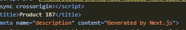
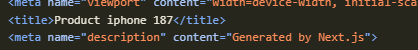

## src/app/products/[productId]/page.tsx
`
export default async function ProductDetails({
    params,
}: {
    params: Promise<{productId: string}>;
}) {
    const productId = (await params).productId;
    return <h1>Details about product {productId}</h1>;
}
`
#### Line1 : export default async function ProductDetails({
- **export default** - a standard JavaScript module feature. Next.js requires the main component of a page or lauout to be the "default export" of the file so the framework can find and render it.
- **async function** - this makes it a React Server Component. Unlike traditional client-side React components, Server Components can be 'async', meaning you can pause rendering to fetch data or await Promises directly inside the component without needing 'useEffect'.

#### Line2:  params,
- Next.js automatically passes specifc props to page components. The **params** prop contains the dynamic route parameter from the URL

#### Line3: }: {
- This Switches from JavaScript destructing into TypeScript type definitions. It tells TypeScript, "here is the shape of the props this function expects"

#### Line4: params: Promise<{productId: string}>;
- this is the TypeScript definiton. It says that **params** is a **Promise** that will eventually resolve to an object containing a **productId** property, which is a string.

#### Line6: const productId = (await params).productId;
- **await params** - because **params** is a Promise, the component pauses execution here until the route parameters are fully resolved by the server
- **.productId** - once the promise resolves into an object (ex, {productId: "122"}), it extracts just the **productId** value
- **const productId** - stores the *extracted* string into a local variable

## src/app/products/[productId]/reviews/[reviewId]/page.tsx
`
export default async function ProductReview({
    params,
}: {
    params: Promise<{ productId: string, reviewId: string}>;
})
{
    const {productId, reviewId} = await params;
    return <h1>Details about product {productId} and review {reviewId}</h1>
}
`
#### Line7: const {productId, reviewId} = await params;
- **const {productId, reviewId}** - this is a standard JavaScript object destucturing. It takes the resolved object and instantly *"unpacks"*the **productId** and **reviewId** properties into their own standalone variables.
- alternate code, this does the exact same thing as line 7, but in 3 lines of code 
1. const resolvedParams = await params; 
2. const productId = resolvedParams.productId; 
3. const reviewId = resolvedParams.reviewId; 

## src/app/docs/[...slug]/page.tsx
`
export default async function Docs(
    {
        params,
    }: {
        params: Promise<{slug: string[]}>;
    }
) {
    const {slug} = await params;
    if(slug?.length === 2) {
        return (
            <h1>
                Viewing docs for feature {slug[0]} and concept {slug[1]}
            </h1>
        );
    }
    else if(slug?.length === 1) {
        return <h1>Viewing docs for feature {slug[0]}</h1>;
    }
    return <h1>Docs Home page</h1>;
}
`

1. this code snippet stores the params/url in **string array**
2. if there is only *1 element* after the parent folder name (here, docs) seperated by a "/", it will execute the "else if" section
   - url - ***localhost:3000/docs/element1***
   - outcome - ***Viewing docs for feature element1***
3. if there is are *2 elements* after the parent folder name seperated by two "/", it will execute the "if" section
   - url - ***localhost:3000/docs/element1/element2***
   - outcome - ***Viewing docs for feature element1 and concept element2***

## src/app/products/[productId]/reviews/[reviewId]/not-found.tsx
`
"use client";
import {usePathname} from "next/navigation";
export default function NotFound() {
    const pathname = usePathname();
    const productId = pathname.split("/")[2];
    const reviewId = pathname.split("/")[4];
    return(
        

            <h2>Review {reviewId} Not Found for product {productId}</h2>
            
Could not find requested review

        

    )
}
`

#### Line1: "use client";
- this proves that this a client-component and not a default server-component. 

#### Line2: import {usePathname} from "next/navigation";
-This is important because the usePathname hook is a client-side hook and cannot be used in server components.

#### Line4: const pathname = usePathname();
#### Line5: const productId = pathname.split("/")[2];
#### Line6: const reviewId = pathname.split("/")[4];
- the pathname is a string that contains the current url path. It is split into an array using the "/" as a separator. The productId and reviewId are extracted from the array using their respective indexes.
- in the url - ***http://localhost:3000/products/17/reviews/1010***,
    - productId = pathname.split("/")[2] = 17
    - reviewId = pathname.split("/")[4] = 1010

## src/app/products/[productId]/page.tsx
`
import {Metadata} from "next";
type Props = {
    params: Promise<{productId: string}>;
}
export const generateMetadata = async ({
    params,
}: Props): Promise<Metadata> => {
    const id = (await params).productId;
    return{
        title: `Product ${id}`,
    };
};
`
#### Line1: import {metadata} from "next";
- imports a specific TypeScript type named 'Metadata' from the Next.js framework

#### Line2-4: type Props = {params: Promise<{productId: string}>;}
- **type Props =** - this creates a custom TypeScript type alias. We are defining the exact "shape" of the data that our fucntion is going to receive
- **params: Promise<{productId: string}>;** - this indicates that once the proimise resolves, it will contain an object with a *productId* that is a 'string'

#### Line5: export const generateMetadata = async({
#### Line6: params,
#### Line7: }: Props): Promise<Metadata> => {
- **export const generateMetadata**- this is a specific Next.js convention, if you export a function with exactly this name from a page file,Next.js will automatically run it on the server before rendering the page to generate the '<head>' HTML tags
- **async** - because we need to wait for the URL parameters (which are a Promise), the function itself must be asynchronous
- **({params})** - we are immediately extracting(destructuring) the *params* property out of the arguments passed to the function
- **: Props** - this applies the TypeScript shape we built in lines 3-5 to the incoming arguments
- **: Promise<Metadata>** - this tells TypeScript, "When this asynchronous function finishes running, it guarantees it will return a valid Next.js Metadata object."

#### Line8: const id = (await params).productId;
- **await params:** - the function pauses here until Next.js has successfully processed the URL and resolved the route parameters
- **.productId** - once the parameters are ready, it extracts the value (for example, if the URL is *"/products/90"*, this grabs the *"90"*)
- **const id =** - it saves that value into a new, local variable named *id*

#### Line9-12: return{ title: `Product ${id}`,}
- **return{ title: `Product ${id}`}** - this returns a JavaScript object back to Next.js containing the SEO confiuration. Next.js will take this and inject ***`<title>Product 90</title>`*** into the HTML document

### Actual Process-
1. The Blueprint (Lines1-4)
   - This top section is purely for TypeScript, it tells "Whenever we deal with URL parameters in this file, expect them to be a Promise containing a string."
2. The SEO Engine (Lines5-12)
    - The *generateMetadata* function handles the invisible part of your webpage- the *<head>* of the HTML document. Next.js explicilty looks for a function with this exact name. It's only job is to figure out what the browser tab should say and what search engines should read.

### Data Flow-
we typed in the url - ***localhost:3000/products/android*** 
1. Next.js receives the request for */products/iphone*. It looks at the folder structure find *src/app/products/[productId]/page.tsx*, and realises this is a dynamic route
2. Next.js takes the dynamic part of the URL ("/android") and packages it into a JavaScript Promise object: ***Promise<{ productId: "android: }>***.
3. Before Next.js even thinks about drawing the page UI, it runs the **generateMetadata** function-
    1. it passes the *Promise* into the function.
    2. the function *await*'s the Promise, unwraps it, and extracts the *"android"*
    3. it returns *{ title: "Product android }*
    4. Next.js holds onto this title in its memory
4. generates the page UI

 
it shows the "Product 187" corresponding to the URL - "http://localhost:3000/products/187"

## src/app/products/[productId]/page.tsx
`
const title = await new Promise((resolve) => {
        setTimeout(() => {
            resolve(`iphone ${id}`);
        }, 100);
    });
`
This block of code is a **mock API call**. Because we don't have a real database connected yet, we are using this code to artifically force the server to wait for 100 milliseconds before giving a fake product name. It proves that our *generateMetadata* function can successfully wait for external data before rendering the SEO tags.

- **new Promise((resolve) => {....})** - in JS, a Promise is a way to handle operations that take time (like fetching data over a network). By writing *new Promise*, you are manually creating a task and telling JS. *"Start this task, and I will let you know when it is finished by calling the "resolve" function."*
- **setTimeout(() => {.....}, 100);** - this is a built-in JS timer. It tells the server to pause and wait for 100 milliseconds before executing the code inside it.
- **resolve(`iphone ${id}`);**
    - once the 100 milliseconds are up, this line fires.
    - Resolve is the switch that tells the Promise, "I am done! Here is your final data."
    - It hands back the string "iphone" combined with the ID from your URL (ex, "iphone 14")

## src/app/layout.tsx
#### Different fields of a Metadata title
`
import {Metadata} from "next";
export const metadata: Metadata = {
  title: {
    default:"Next.js Tutorial -  Code with Tanveer",
    template: "%s | Code with Tanveer",
    absolute: "",
  },
  description: 'Generated by Next.js',
}
`
shows the different types/ways of adding Metadata title as an object
1. **default: "",** - for pages/routes that don't have their own *Metadata title*, it is replaced by the value in the default title
2. **template: "",** - for pages/routes that have their own *Metadata title*, it **appends/suffixes** the title with page's own metadata title
3. **absolute: "",** - it is used to overwrite the parent segment's metadata title

`
export const metadata: Metadata = {
    title: "Blog",
}
`
- shows the **static** metadata title of a page
- (default: "", won't work on it as it already has its own metadata title)
- (template: "", can be used to append the metadata title)

`
export const metadata: Metadata = {
    title: {
        absolute: "Blog",
    },
}
`
- is used to overwrite the parent segment's metadata title
- (wrote in the children component/page)