# **React Server Components**
React Server Components is a new architecture that was introduced by the React team and quickly adopted by Next.js. 
This architecture introduces a new approach to creating **React** componnets by dividing them into two distinct types:
- **Server components**
- **Client components**

### **Server Components**
- By default, Next.js treats all components as **Server** components
- These components can perform server-side tasks like reading files or fetching data directly from a database
- The trade-off is that they can't use *React hooks* or *handle user interactions*

### **Client Components**
- To create a Client component, you will need to add the **"use client** directive at the top of your component file
- While Client component cannot perform *server-side tasks* like readinf files, they can use *hooks* and *handle user interctions*
- Client components are the traditional React components you're already familiar with from orevious versions of React

### **React Server Components & Routing**
We will work with **server components** that wait for certain operations to complete before rendering content. 
We will also use **client components** to take advantage of hooks from the routing module.

# **Routing**
Next.js has a file-system based routing system. 
URLs you can access in your browser are determined by how you organize your files and folders in your code.

### **Routing conventions**
1. All routes must live inside the app folder
2. Route files must be named either ***page.js*** or ***page.tsx***
3. Each folder represents a segment of the URL path

When these conventions are followed, the file automatically becomes available as a route.

### **Page Structure**

- all the routes are inside the ***app folder***
- the ***page.tsx*** under the ***app folder*** is the main page (**Home page**)
- to create a different page, appropriate folders are made inside the app folder (for ex, about, profile)
- all the routes are named using ***page.tsx*** file under the appropriate folder
- in Next.js, no need to create perfect routing structure like in React, the **file/folder structure** will handle the ***routing***
- if the user searches for any other routes that do not exist, Next.js will automatically show him a built-in ***"Error 404: Page Not Found"*** page 

## **Nested Routes**
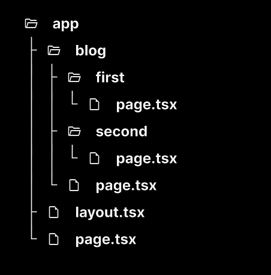
- Nested routes refers to the pages located in their parent pages
- like pages **'first'** and **'second'** (with their own *page.tsx* files) are located within the **'blog'** page [folder]
- so the parent route is ***localhost:3000/blog***
- while the nested (children) routes are ***localhost:3000/blog/first*** and ***localhost:3000/blog/second***

## **Dynamic Routes**
This is required when we need to create indefinte number of pages (for example, profiles, item descriptions, products), we cannot manually create folders(pages) for each one of them, so we need to create routes **dynamically** than manually

- we write the folder's name in '[]' (square brackets) to signify the ***dynamic segment*** in the project
- here, **[productId]** is the **dynamic** folder, making the url **"localhost:3000/products/:id"**
- whether we write **':id'** as 1 or 100, i's going to show a new page with the same details, thus creating dynamic routing

## **Dynamic Nested Routes**
 
works the same way as Nested routes and Dynamic routes **combined** together 
URL - ***localhost:3000/products/1/reviews/1***

## **Catch-all Segments**
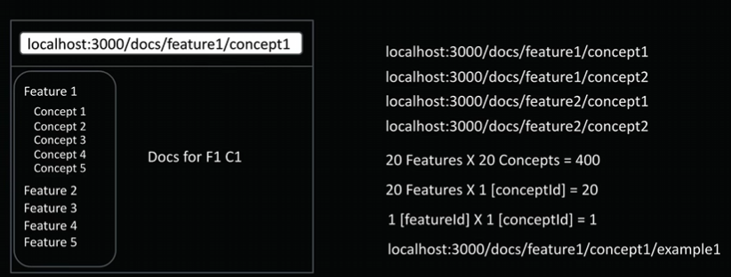
#### Intro
- as shown in here, if we had *20 features* and *20 concepts* for **each feature**, if we didn't use Dynamic Routing, we would have needed (20*20 =)400 seperate files
- but using Dynamic Routing, we use a *single file* for the features and a *single file* for the concepts, making the URL - *localhost:3000/features/20/concepts/20*, which makes file handling much easier
- but if we were to add another layer of nesting- 20 examples for each concept of each feature, it can become **complicated**
- **catch-all segments** is used to solve the nesting problem, requiring only **1 file** to handle all the nested files/urls

#### Implementation

1. create a new folder in the app folder, let's name it *docs*
2. then create another folder in the *docs* folder, the naming being ***[...(anything)]***, let's call it ***[...slug]***
    - the name should be in *square brackets* ([]) and should start with *three dots*
    - *"slug"* is a common term for "urls"
3. then create a page.tsx file under the ***[...slug]*** folder with a return statement
4. now whenever you type in a url with the parent folder name (here, *docs*) in it followed by something, example, ***localhost:3000/home/docs/features/concepts***; it wil return the content of the *page.tsx* file
    - the url shouldn't be ending with the parent folder name, ex - ***localhost:3000/home/docs***, or it will show error.
5. therefore, this is the **"catch-all segments"** that catches all the urls containing the parent folder name, thus, requiring only 1 file for handling the rest of the nested links
6. if we want to make sure that the url - ***localhost:3000/home/docs*** also works (and doesn't return with an error message), we need to change **[...slug]** to **[[...slug]]** *(adding extra square brackets)*
7. adding this extra square brackets to the *[...slug]* to *[[...slug]]*, makes the [...slug] path optional, thus allowing urls to directly jump to the **page.tsx** content

how to know to use just a *page.tsx* file and/or a *catch-all segments* concept
- if there are no changes in UI irresepective of the path/url, use just a *page.tsx* file
- if there are changes in UI resepective of the path/url (here), use *catch-all segments* concept

#### Code Snippet
- this code snippet stores the params/url in **string array**
- if there is only *1 element* after the parent folder name (here, docs) seperated by a "/", it will execute the "else if" section
   - url - ***localhost:3000/docs/element1***
   - outcome - ***Viewing docs for feature element1***
- if there is are *2 elements* after the parent folder name seperated by two "/", it will execute the "if" section
   - url - ***localhost:3000/docs/element1/element2***
   - outcome - ***Viewing docs for feature element1 and concept element2***

## **Not-Found Page**
- if we write a url that doesn't correspond to any built route, Next automatically shows a "404: Not Found Page"
- but if we wanted a custom not-found page, we create a **not-found.tsx** file under the app folder
    - as shown in "src/app/not-found.tsx
- so whenever a non-appropriate url is entered, Next automatically returns the *not-found.tsx*
- the name **not-found** should be exact with a hyphen (-)
- the *custom not-found page* can also be rendered depending on a trigger/action
    - as shown in "src/app/products/[productId]/reviews/[reviewId]/page.tsx
- also a **seperate** custom not-found page can be made for different paths
    - as shown in "src/app/products/[productId]/reviews/[reviewId]/not-found.tsx
- not-found.tsx doesn't pass any **props**
- therefore, we use usePathname hook, which is a client-side hook and cannot be used in server components.

## **File Colocation**
- if a folder in Nextjs under the 'app' folder doesn't have a **"page.tsx"** named file, it won't become a route/path/url
- also that "page.tsx" file should **export** a default function/return statement
- therefore we can safely store folder/files in the main 'app' folder withour worrying about it becoming a path, as long as we don't insert a "page.tsx" file in the certain folder

## **Private Folders**
- **Private folders** are created for internal stuff, not included in *routing sytem*
- The folder and al its subfolders are excluded from routing
- Adding an **underscore (_)** at the start of the folder name makes it private.

Private folders are super useful for the following things
1. Keeping the UI logic seperate from routing logic
2. Having a consistent way to organize internal files in your project
3. Making it easier to group related files in your code editor
4. Avoiding potential naming conflicts with future Next.js file naming conventions

- *If we want an underscore(_) in the URL, use "%5F" instead. This is the URL-encoded vesrion of an underscore.*

Let's have a case study on this
- **Scenario A**
    - folder named "_lib", url - localhost:3000/_lib
    - output - 404, Page Not Found
- **Scenario B**
    - folder named "_lib", url - localhost:3000/%5Flib
    - output - 404, Page Not Found
- **Scenario C**
    - folder named "%5Flib", url - localhost:3000/_lib
    - output - You cannot view this in the browser (can view the page)
- **Scenario D**
    - folder named "%5Flib", url - localhost:3000/%5Flib
    - output - 404, Page Not Found

## **Route Groups**
- **Route groups** lets us logically organize our routes and project files without impacting the URL structure
- naming a folder in **parenthesis ()** makes it a routing group
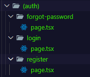
- for example, in the above image, the urls/path for register, login, forgot-password are -
   - localhost:3000/register
   - localhost:3000/login
   - localhost:3000/forgot-password

instead of - localhost:3000/auth/register

# **Layouts**
- Pages are route-specific UI components
- A **layout** is UI shared between multiple pages in your app (ex, header, footer, sidebar)

#### How to create layouts
- default export a React component from a layout.js or lyout.tsx file
- that component takes a children prop, which Next.js will populate with your page content 
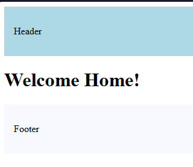
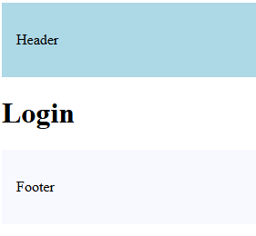 
changes in the layout.tsx is shared by the whole site
- whenever we open a url path, the content of the corresponding "page.tsx" file replaces the **{children} prop** in the "layout.tsx"

## **Nested Layouts**
- Next.js allows us to **nest** layouts
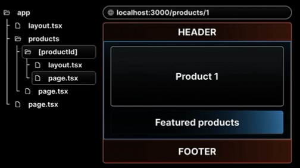
1. *localhost:3000*, root "layout.tsx" gets rendered in the app folder
2. *localhost:3000/products*, the "page.tsx" file of the "products" folder replaces the {children} **prop** in the root layout.tsx file
3. *localhost:3000/products/1*, the "layout.tsx" in the "products" folder becomes the {children} prop in the root layout
    - the "layout.tsx"(ProductDetailsLayout) in the "products" folder contains the *"Featured products" line
    - then, the "page.tsx" file of the products folder, gets rendered as the {children} prop in the productId's layout
    - thus, we see the "page.tsx's component' rendered with the "Featured products" of the "layout.tsx"(ProductDetailsLayout), sandwiched between the 'header' and 'footer' of the root layout file

## **Multiple Nested Layouts**
- Next.js allows us to create multiple different layouts for different parts of the site
- if we make changes in the **root** "layout.tsx" file, it will appear over the whole site and we cannot change it
- we use **Route Groups** to make multiple layouts for different parts of the site

How to make multiple nested layouts
**Setup** - we have two different route groups *(A)* and *(B)* which have their seperate different folders in them and make neccessary changes in the layout
1. copy the **root** "layout.tsx" file to route group *(A)* and *(B)*, and change the function name to something corresponding in both files
2. if we check the server, it will respond with an 'error'
3. so, we move the **root** "page.tsx" file to route group *(B)* which amends the error
4. when we check the different urls from the two route groups, they have their own layout styling 
this is how we create multiple different layouts for different parts of the site

# **Routing Metadata**
- The Metadata API in Next.js is a powerful feature that lets us define metadata for each page.
- Metadata ensures our content looks great when it's shared or indexed by search engines
- there are two ways to handle metadata in layout.tsx or page.tsx files-
    1. export a **static** *metadata* object
    2. export a **dynamic** *generateMetadata* function

#### Metadata Rules-
1. Both layout.tsx and page.tsx can export metadata. Layout metadata applies to all its pages, while page metadata is specific to that page.
2. Metadata follows a top-down order, starting from the root level.
3. When metadata exists in multiple places along a route, they merge together, with page metadata overriding layout metadata for matching properties

#### Scenario
- **root layout.tsx** metadata 
`
export const metadata = {
  title: 'Next.js',
  description: 'Generated by Next.js',
}
`
- **page.tsx** metadata 
`
export const metadata = {
    title: "About Tanveer"
}
`  
**localhost:3000** 
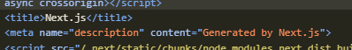 
**localhost:3000/about** 
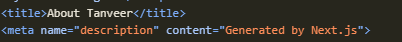 
as we can see the **metadata titile** of the root layout.tsx is replaced by the page.tsx one

#### Dynamic Metadata
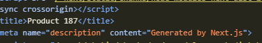
- it shows the "Product 187" corresponding to the URL - "http://localhost:3000/products/187"
- in real-life applications, we can use APIs to generate seperate metadata for each dynamic page

#### Key Limitattions of Metadata-
1. we cannot use *'Metadata object'* and *'generateMetadata function'* in the same route segment, we need to use either
2. Metadata won't work in pages marked "use client" directive

 
as we see, when we use **metadata** in a page with "use client"; directive, we get an error message

## **Title Metadata**
- the title field's primary purpose is ot define the document title
- it can be either a string or an object

there are three ways to describe **Metadata title** as an object
1. **default: "",**
    - for pages/routes that don't have their own *Metadata title*, it is replaced by the value in the default title
    - for, default: "Next.js Tutorial -  Code with Tanveer",  
    - output, 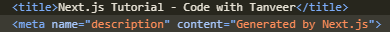
2. **template: "",**
    - for pages/routes that have their own *Metadata title*, it **appends/suffixes** the title with page's own metadata title
    - it is mostly used for multi page applications
    - where consistent tiny formatting is required across all the pages
    - for, template: "%s | Code with Tanveer",  
    - output, 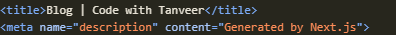
    - (the "%s" is replaced by the pages's metadata title)
3. **absolute: "",**
    - it is used to overwrite the parent segment's metadata title
    - for, export const metadata: Metadata = {title: {absolute: "Blog",},}  
    - output, 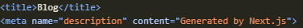
    - (the output is the value in the **"absolute: "** field, overwriting the "template: " value in the parent segment)

# **Navigation**
- Next.js has File based routing system
- we have defined routes for our application's root, nested, dynamic and catch-all routes
- we have been typing URLs directly in the browser to test these routes
- but users don't type specific URLs to naviagte, they use
    - click on links
    - `get redirected after certain actions

## **UI Navigation**
#### Scenario A : navigating from 'Home' page to 'Blog' page, & vice-versa
- for client-side navigation, Next.js gives us the **`<Link>`** component.
- the **`<Link>`** component is a React component that extends the HTML **`<a>`** element, abd it's the primary way to navigate between routes in Next.js.
- to use it, we will nedd to import the **next/link**.

1. **Normal Link Navigation**
    -  `<Link href="/blog">Blog</Link>`
2. **Dynamic Link Navigation**
    - `<Link href="/products/1">Product 1</Link>`
    - used for *dynamic routes* - (/products/:id)
3. **Replace**
    - `<Link href="/products/3" replace>Product 3</Link>`
    - **"replace"** overrides the current history entry instead of creating a new one

### **Active Links**
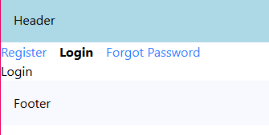

## **params and searchParams**
For a given URL,
- ***params*** is a promise that resolves to an object containing the dynamic route parameters (like id)
- ***searchParams*** is a promise that resolves to an object containing the query parameters (like filters and sorting)
- while page.tsx has access to both **params** and **searchParams**, layout.tsx only has access to **params**

## **Navigating Programmatically**
In **Navigating Programmatically**, instead of the user clicking on link themselves to move on to the next step in a certain sequence, the system **programmatically** takes the user to the next page/route. 
For example, after adding products in the cart while shopping on Amazon, the system automatically takes you to address confirmation and then payments page. 
Types of -
- **router.push("/");** - pushes to the specifiec destination route
- **router.replace("/");** - replaces the current route in the history stack with the new route, so the user cannot go back to the previous page using the back button.
- **router.forward("/");** - to go to previous page
- **router.back("/");** - to move forward in the history stack to the next page
- **redirect("/products");** - we redirect the user to the 'products' page

# **Templates**
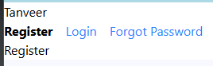
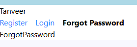 
- As we see in the above images, the state is preserved (input component - "Tanveer") even when the route are changed from 'Register' to 'Forgot-Password'
- this happens, as **'Layouts'** only mount the new page content while keeping common elements (like, "Tanveer") intact
- they don't mount shared components, leading to better performance
Sometimes we may need the 'Layout' to create a fresh instance for each child component during navigation, this can become useful for scenarios like entry and exit animations  
- **Templates** are similar to layouts in that they are also UI shared between multiple pages in your app
- whenever a user navigates between routes sharing a template, we get a completely fresh new start
    1. a new template component instance is mounted
    2. DOM elemenst are recreated
    3. state is cleared
    4. effects are re-synchronized
- create a template by exporting a default React component from a **template.tsx** or **template.js**
- like layouts, templates need to accept a children prop to render the nested route segments

After renaming 'layout.tsx' to 'template.tsx'- 
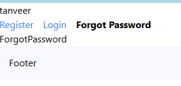
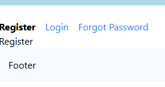 
As we see in the above images, the state is not preserved (input component - "tanveer") even when the route are changed from 'Forgot-Password' to 'Register'  

- we can use both 'layout.tsx' & 'template.tsx' files togther
- in this case, 'layout.tsx' is rendered first, then its children are replaced by 'template.tsx' components

# **Loading UI**
#### **loading.tsx**
- this file helps us create loading states that users see while waiting for content to load in a specific route segment
- the loading states appear instantly when navigating, letting users know that the application is responsive and actively loading content 
- the **loading.tsx**  file should place in the correct folder for the route to a working *loading*
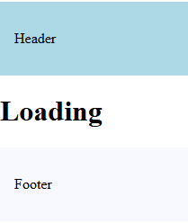
#### **loading.tsx Benefits**
1. It gives users immediate feedback when they navigate somewhere new
    - this makes the app feel snappy and responnsive, and users know their click actually did something
2. Next.js keeps shared layouts interactive while new content loads
    - users can still use things like navigation menus or sidebars even if the main content isn't ready yet

# **Error Handling**
#### **error.tsx**
- to learn how to handle errors, we manually create a code to throw an error randomly
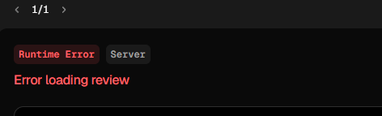
- this is how the error is shown in the ***dev*** mode
- if the app was in ***production*** mode, we are shown with this message, thus, making the app inoperable
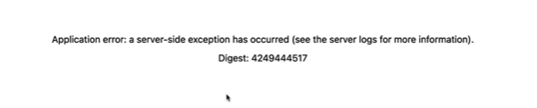
- to manage this, we create an **error.tsx** file to handle the errors without breaking the app, like this
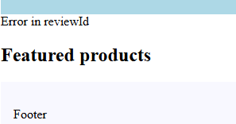
- but **error.tsx** file is a client component, so we need to use **"use client";**   
- it automatically wraps route segments and their nested children in a **React Error Boundary**
- we can create custom error UIs for specific segments using the file-system hierarchy
- it isolates errors to affected segments while keeping the rest of your app functional
- it enables us to attempt to recover from an error without requiring a full page reload  
## **Component Hierarchy**
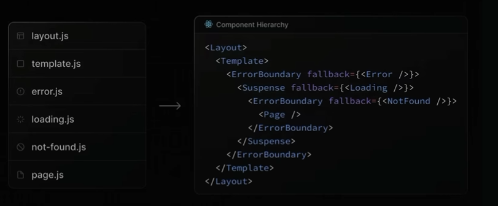

# **Recovering from Errors**
# **Handling Errors in Nested Errors**
- Erros always bubble up to find the closest parent error boundary
- an **error.tsx** file handles errors not just for its own folder, but for all the nested child segments below it too
- by strategically placing **error.tsx** files at different levels in our own route folders, we can control exactly how detailed our error handling gets
- where we put the **error.tsx** file makes a huge difference - it determines exactly which parts of our UI get affected when things go wrong
### Scenario A: when the error.tsx file is in the nested-subfolder i.e. **src/app/products/[productId]/reviews/[reviewId]/error.tsx
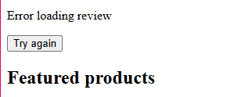 
we see that the content of the "reviews" sub-folder is shown even when the error triggers
### Scenario B: when the error.tsx file is in the parent-folder i.e. **src/app/products/error.tsx
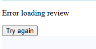 
even though the erro occured in the "reviews" sub-folder, the error bubbles up to the 'error boundaries' in the "error.tsx" file present in the parent folder, thus replcaing the content of the "reviews" sub-folder

# **Handling Errors in Layouts**
- the error boundary won't catch errors thrown in *'layout.tsx'* within the same segment because of how the component hierarchy works
- the layout actually sits above the error boundary in the component tree
  
- as we see, when thers is an error in the layout file, the error.tsx file cannot handle the error due to hierachy
 
how to solve this?
- move the **error.tsx file** to the parent folder, allwoing the error.tsx file to handle such errors

# **Handling Global Errors**
- if an error boundary can't catch errors in the *layout.tsx* file from the sam esegment, what about errors in the root layout!!
- it doesn't have a parent segment- how do we handle such errors?
- Next.js provides a special file called **global-error.tsx** that goes in the root app directory
- this is our last line of defense when something goes catastrophically wrong at the highest level of your app
1. works only in production mode
2. requires html and body tags to be rendered

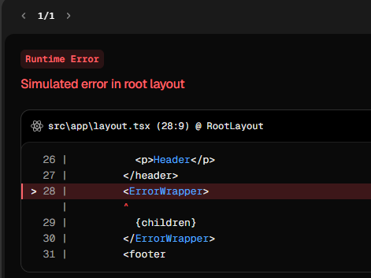 
- even after adding the **"global-error.tsx"** file in the root folder, it is still not able to handle the queries
- for that to happen, the app needs to be in *production build* and needs the global-error.tsx file to be present in `<html>` and `<body>` tags
- after the app was build in production mode...
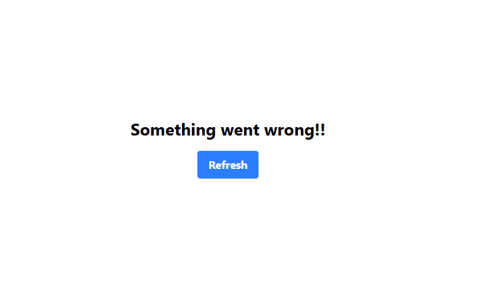 

# **Parallel Routes**
- Parallel routing is an advanced routing mechanism that lets us render multiple pages simultaneously within the same layout

#### Scenario:
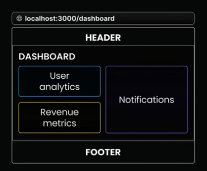 
to load the different components - *"User Analytics"*, *"Revenue Metrics"*, *"Notifications"*, in the same page at the same time, traditionally we need to
1. make three different components- *"User Analytics"*, *"Revenue Metrics"*, *"Notifications"*
2. organize them in a layout.tsx
3. under a 'dashboard' folder in the 'app' folder  
***How to set up Parallel Routes***
1. Parallel routes in Next.js are defined using a feature know as ***"slots"***
2. Slots help organize content in a modular way
3. to create a slot, we use the ***'@folder'*** naming conversation
4. each defined slot automatically becomes a prop in its corresponding 'layout.tsx' file
we require the following folder(and slot) structure
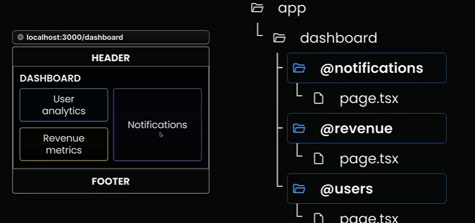  
if we had done this traditionally without using parallel routes, the layout.tsx file would have looked like this-
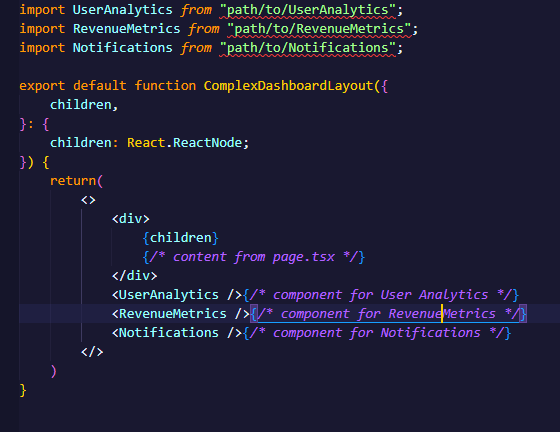 